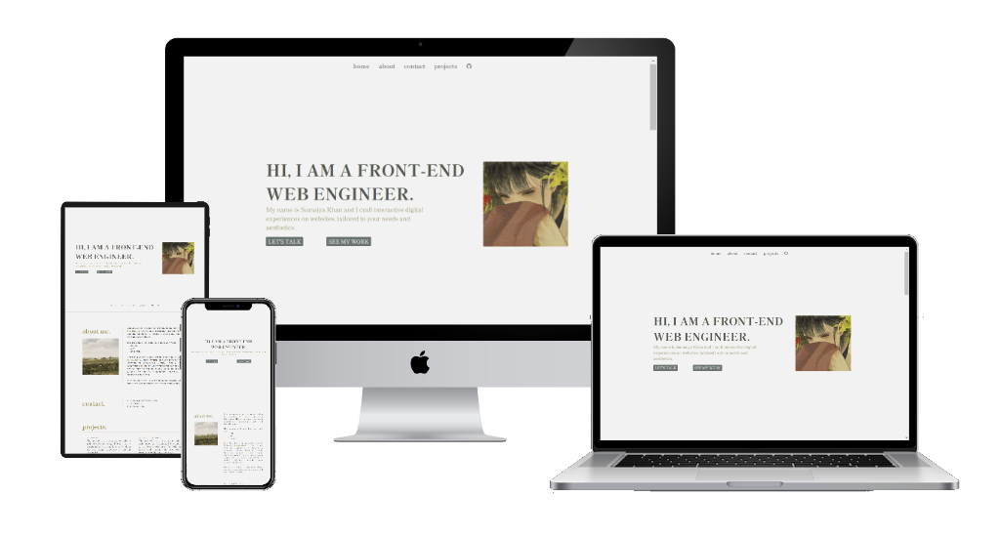
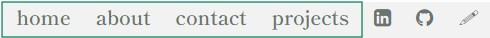
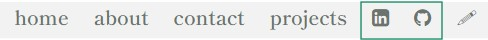
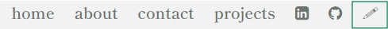
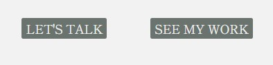
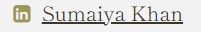
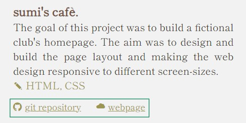
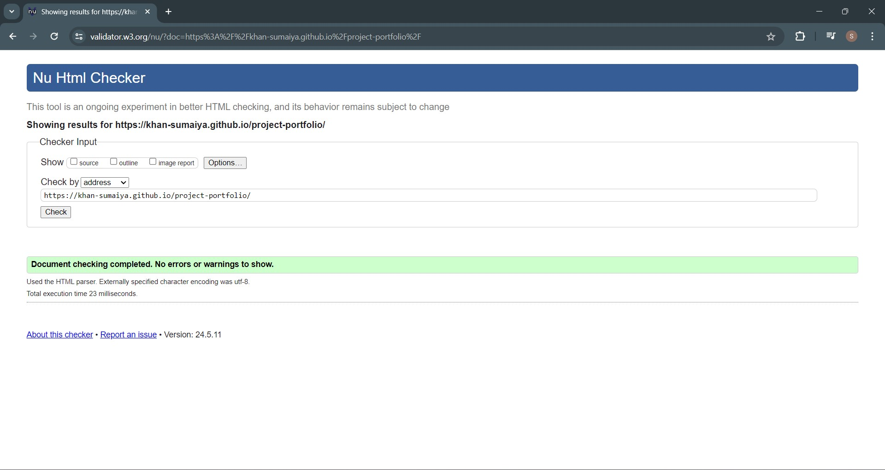
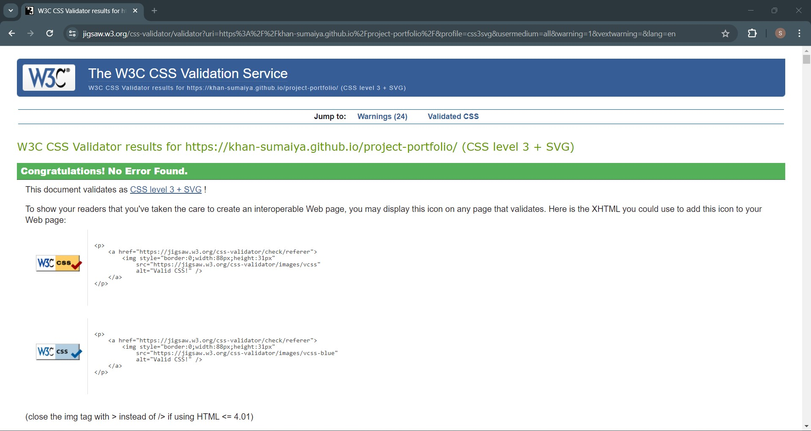

# Project-Portfolio

## Overview.
Welcome to my [project-portfolio](https://khan-sumaiya.github.io/project-portfolio/)!
This README.txt file equips you with the essential information about the aim, purpose and the features of the website.
In this project I wrote custom CSS and HTML code to design a "pleasing to the eyes" portfolio website. The aim of the project-portfolio was to put my CSS and HTML knowledge into practice to create a portfolio website that is responsive and interactive. Users will be able to view my previous projects.

## Features.
The website comprises of 2 pages: the home page and the form page (through which users can send messages to the developer).

### Home page
#### 1)  navbar
- At the very top of the page, the navbar comprises of links that anchor to different sections of the webpage (home, about, contact and projects). When one of themis clicked, it scrolls down to the corresponding section:

- Following that, the LinkedIn and GitHub icons are links that takes the user to my LinkedIn and GitHub profile:

- The pencil icon anchors the form page, which is separate from the home page:

### 2) banner
- In the banner, there are two buttons and when clicked:
  1) "let's talk" button = takes user to the form page, where they can enter their details and the message.
  2) "see my work" button = page scrolls down to the projects section.

### 3) contact section
- Clicking on "Sumaiya Khan" takes user to my LinkedIn profile.

### 4) projects section
- Project section comprises of a list of my previous projects, each project has its GitHub repository and the live webpage anchored below the project description.

- The website is responsive on:
   - desktop and laptop screen sizes >> features scaled up.
   - tablet and mobile screen sizes >> features scaled down.

## Technologies used:
  - HTML used for structuring the website.
  - CSS used for adding animations,styling and organising layout of the website.
  - CSS Flexbox used for positioning elements symmetrically.
  - VSCode used for writing the code.
  - GitBash used as version control.
  - GitHub for hosting the code of the website.

## HTML files have passed the HTML validity checks on W3C

## CSS file has passed the CSS validity checks on W3C

## Media
The illustrations used in the website were sourced from Pinterest.

## Contact
Sumaiya Khan
sumaiya16khan@gmail.com
